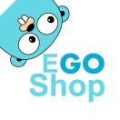

# EGoShop
## 1 介绍
EGoShop是Go语言实现的商城项目。



特性
* 最新的技术： 前台使用uniapp，后台使用ant design，后端使用go。部署简单、使用方便。
* 性能极佳： Go的超强性能，再加上合理cache。单机部署使用leveldb做cache，多机部署使用redis做cache
* 可观测性： 完善的后台监控，方便查看你的商城api情况


## 2 使用
```bash
在自己的mysql里创建一个egoshop的数据库

make local.createdb # 创建自己数据库结构

make local.mockdb # 同步db数据

make go.api # 运行小程序的go程序

make wechat # 运行小程序

make go.admin # 运行admin的go程序

make ant # 运行后台

```

## 3 体验
* 小程序地址


* [后台地址](https://egoshop.questionfans.com) 
* 账号: egoshop 密码: egoshop


## 4 监控


## 5 贡献代码

[CONTRIBUTING](./CONTRIBUTING-CN.md)

## 6 加入我们


## 7 参考代码
* https://github.com/mojisrc/fashop
* https://github.com/dingyong0214/ThorUI-uniapp
* https://github.com/bilibili/kratos

## 8 LICENSE

[Apache License 2.0](./LICENSE)
