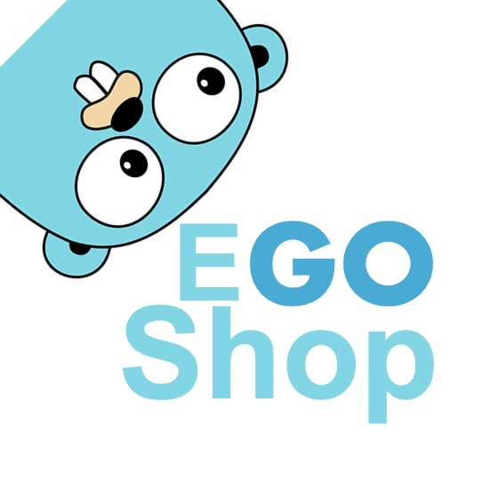

# EGoShop
## 1 介绍
EGoShop是Go语言实现的商城项目。



特性
* 最新的技术： 前台使用uniapp，后台使用ant design，后端使用go。部署简单、使用方便。
* 性能极佳： Go的超强性能，再加上合理cache。单机部署使用leveldb做cache，多机部署使用redis做cache
* 可观测性： 完善的后台监控，方便查看你的商城api情况


## 2 使用
```bash
在自己的mysql里创建一个egoshop的数据库

make local.createdb # 同步自己的数据库

make local.mockdb # 同步db数据

make go.api # 运行api的go程序

make go.admin # 运行admin的go程序

make wechat # 运行小程序
 

```
## 3 监控


## 4 贡献代码

[CONTRIBUTING](./CONTRIBUTING-CN.md)

## 5 加入我们


## 6 LICENSE

[Apache License 2.0](./LICENSE)
