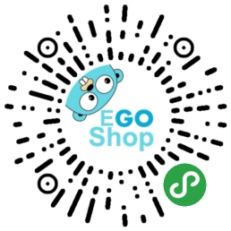
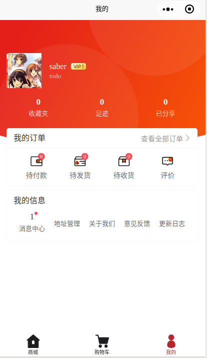
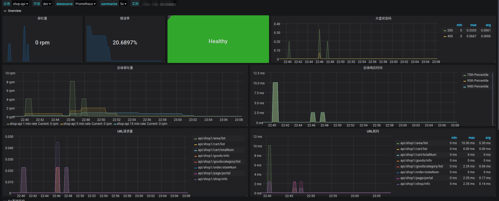

## 1 概述

[EGoShop](https://github.com/goecology/egoshop) 是GO语言实现的商城项目。

目前业界大部分商城项目都是PHP或者Java的商城项目，但很少有比较完善的Go的商城项目。

因此我们参考了业界的[Fashop](https://github.com/mojisrc/fashop)项目，经过一些改造后，完成了[EGoShop](https://github.com/mojisrc/fashop)。

EgoShop详细介绍请看[文档](http://doc.egoshop.questionfans.com/ecology/)

## 2 介绍

[EGoShop](https://github.com/goecology/egoshop)使用了GO，Vue，React技术，Gin，Uniapp，Ant Deign Pro框架。使得我们的系统更加易于部署，开发和维护。

### 2.1 演示环境
* [项目地址](https://github.com/goecology/egoshop)
* [文档地址](http://doc.egoshop.questionfans.com/)
* 小程序地址
  
* [后台地址](https://egoshop.questionfans.com) 
* 账号: egoshop 密码: egoshop

### 2.2 截图

#### 小程序截图



#### 后台截图


#### 监控截图



### 2.3 功能特性

* 商城首页
* 商品详情
* 分类页（todo）
* 搜索页（todo）
* 购物车
* 个人中心
* 地址管理
* 订单管理（fix bug）
* 支付
* 收藏记录
* 浏览记录
* 消息中心（todo）
* 积分管理（todo）

### 2.4 技术特性

| 名称        | 特性1               | 特性2        | 特性3           |
| ----------- | ------------------- | ------------ | --------------- |
| 首页cache   | redis cache support | 接口 support | file cache support |
| 详情页cache | redis cache support    | 接口 support | file cache support |
| 文件上传    | oss support         | file support    |                 |
| session     | redis support       | memory support    |                 |
| jwt         | mysql support       | redis todo   | file todo       |
| 可观测性    | prometheus support  |              |                 |

## 3 安装

### 3.1 二进制包安装

```
wget https://github.com/goecology/egoshop0.1.0.tar.gz(todo，还没发布release包)
tar xvf egoshop0.1.0.tar.gz
./egoshop install
./egoshop start
访问http://127.0.0.1:9001
```

### 3.2  编译安装

todo

## 5 设计

## 6 开发

```
在自己的mysql里创建一个egoshop的数据库

make install # 创建自己数据库结构

make go # 运行go程序

make wechat # 运行小程序

make ant # 运行后台

make all # 全部编译
```

## 7 加入我们


## 8 LICENSE

[Apache License 2.0](https://github.com/goecology/egoshop/blob/master/LICENSE)
